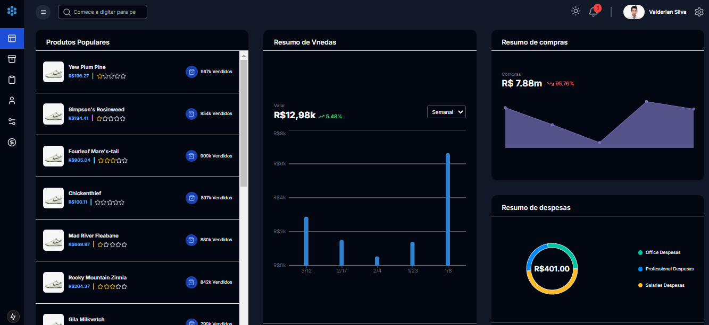

# Sistema de Gestão de Inventário

O objetivo do projeto é oferecer uma ferramenta prática e visual para empresas acompanharem informações importantes sobre vendas, compras, produtos populares e outros indicadores-chave de desempenho (KPIs). O sistema foi projetado para facilitar o acesso a dados relevantes e auxiliar na tomada de decisões estratégicas. Essa aplicação foi desenvolvida utilizando tecnologias modernas como o React, Next.js, Tailwind e Redux. O projeto foi projetado para ser altamente escalável, com uma interface de usuário limpa e intuitiva.

### Tecnologias Utilizadas
  - NextJS
  - Tailwind CSS
  - Redux Toolkit
  - Redux Toolkit Query
  - Material UI Data Grid
  - Node.js
  - Prisma

### Funcionalidades Principais
- Dashboard analítico com múltiplos cartões informativos
- Resumo de vendas com gráfico de barras
- Visualização de despesas em gráfico de pizza
- Lista de produtos populares
- Resumo de compras
- Gerenciamento de estatísticas de negócio 

### Ajustes e melhorias

O projeto ainda está em desenvolvimento e as próximas atualizações serão voltadas para as seguintes tarefas:

- [ ] Implementar sistema de login, para cada usuário específico, fazendo com que cada um tenha seus próprios dados.
- [ ] Implementar inclusão, exclusão e edição dos produtos para cada login.
- [ ] Implementar autenticação avançada - (OAuth2).
- [ ] Implementar testes automatizados.

## 💻 Pré-requisitos

Antes de começar, verifique se você atendeu aos seguintes requisitos:

- Você instalou a versão mais recente de `Node.js (versão 18+) / npm ou yarn`
- Você tem uma máquina `Windows / Linux / Mac`.

## 🚀 Instalando o Sistema de Gestão de Inventário

Para instalar o Sistema de Gestão de Inventário, siga estas etapas:

#### Clone o repositório
`git clone https://github.com/valderlanjs/InventoryManager.git`

#### Instale as dependências
*cd client*
`npm install`

*cd server*
`npm install`

#### Configuração do Banco de dados
Antes de iniciar, configure as variáveis de ambiente no arquivo `.env`.

`PORT`
`DATABASE_URL` - utilizei o postgresql, mas pode utilizar um de sua preferência.

Inicialize o banco de dados e execute o seed:

`npx prisma migrate dev`

`npx prisma db seed`

#### Inicie o servidor de desenvolvimento
`npm run dev`: para o client e para o server

## 📂 Estrutura do Projeto 
      InventoryManagement/
      ├── client/
      │   ├── src/
      │   │   ├── app/
      │   │   │   ├── (components)/
      │   │   │   │      │────── Header
      │   │   │   │      │         │────── index.tsx
      │   │   │   │      │────── Navbar
      │   │   │   │      │         │────── index.tsx
      │   │   │   │      │────── Rating
      │   │   │   │      │         |────── index.tsx
      │   │   │   │      │────── Sidebar
      │   │   │   │      │         |────── index.tsx
      │   │   │   ├── dashboard/
      │   │   │   │      ├── CardExpenseSummary.tsx
      │   │   │   │      ├── CardPopularProducts.tsx
      │   │   │   │      ├── CardPurchaseSummary.tsx
      │   │   │   │      ├── CardSalesSummary.tsx
      │   │   │   │      ├── page.tsx
      │   │   │   │      ├── StatCard.tsx
      |   |   |   ├── expenses/
      │   │   │   │      │───── page.tsx
      |   |   |   ├── inventory/
      │   │   │   │      │───── page.tsx
      │   │   │   ├── products/
      │   │   │   │      │───── CreateProductModal.tsx
      │   │   │   │      │───── page.tsx
      │   │   │   ├── settings/
      │   │   │   │      │───── page.tsx
      │   │   │   ├── users/
      │   │   │   │      │───── page.tsx
      │   │   │   |
      │   │   │   ├── dashboardWrapper.tsx
      │   │   │   |
      │   │   │   ├── globals.css
      │   │   │   |
      │   │   │   ├── layout.tsx
      │   │   │   |
      │   │   │   ├── page.tsx
      │   │   │   |
      │   │   │   ├── redux.tsx.tsx
      │   │   │   |
      │   │   ├── state/
      │   │   │   ├── api.ts
      │   │   │   ├── index.ts
      ├── server/
      │   ├── assets/
      │   │     ├── imgs...
      │   │
      │   │
      │   ├── prisma/
      │   │     ├── schema.prisma
      │   │     ├── seed.ts
      │   │
      │   │
      │   ├── src/
      │   │     ├── controllers/
      │   │     │      ├── dashboardController.ts 
      │   │     │      ├── expenseController.ts.ts
      │   │     │      ├── productController.ts
      │   │     │      ├── userController.ts 
      │   │     │
      │   │     ├── routes/
      │   │     │      ├── dashboardRoutes.ts 
      │   │     │      ├── expenseRoutes.ts.ts
      │   │     │      ├── productRoutes.ts
      │   │     │      ├── userRoutes.ts   
      │   │     
      │   ├── index.ts

## Endpoints da API

### Dashboard
  - `GET /dashboard`
  Retorna métricas detalhadas para o painel administrativo.

### Produtos
  - `GET /products`
  Recupera produtos com suporte a filtro por nome.
    #### **Query Parameters:**
    - `search`: (opcional) Termo para buscar produtos.

  - `POST /products` 

    Cria um novo produto
    
    **Body**:
      
        {
          "name": "Produto Exemplo",
          "price": 100.0,
          "rating": 4.5,
          "stockQuantity": 50
        }

### Usuários
  - `GET /users`
  Lista todos os usuários cadastrados.

### Despesas
  - `GET /expenses`
  Retorna o resumo de despeseas categorizadas.

## 📫 Contribuindo para Sistema de Gestão de Inventário

Para contribuir com Sistema de Gestão de Inventário, siga estas etapas:

1. Bifurque este repositório.
2. Crie um branch: `git checkout -b <nome_branch>`.
3. Faça suas alterações e confirme-as: `git commit -m '<mensagem_commit>'`
4. Envie para o branch original: `git push origin main `
5. Crie a solicitação de pull.

Como alternativa, consulte a documentação do GitHub em [como criar uma solicitação pull](https://help.github.com/en/github/collaborating-with-issues-and-pull-requests/creating-a-pull-request).

## 🤝 Criador

<table>
  <tr>
    <td align="center">
      <a href="#" title="Criador">
         
        
          <b>Valderlan Silva</b>
        
      </a>
    </td>
  </tr>
</table>

## 📝 Licença

Esse projeto está sob licença. Veja o arquivo [LICENÇA](LICENSE) para mais detalhes.

## Prévia da Aplicação

Demo <a href="https://main.d3u8bucqhwgs53.amplifyapp.com/" target="_blank">Demo</a>.
